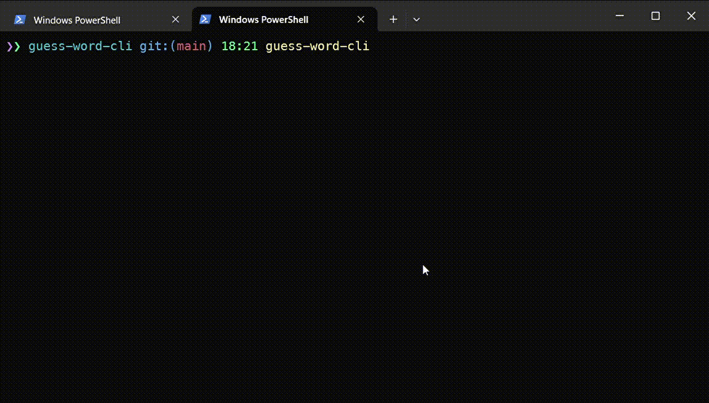

# guess-word-cli [![NPM version][npm-image]][npm-url]

> CLI game - find out a source word which characters was shuffled and moreover an extra character was added to bring some complexity.

## Install

```bash
$ npm install --global guess-word-cli
```

## CLI

```
$ guess-word-cli --help

  Usage
    $ guess-word-cli

  Options
		--round, -r       Run game with specified suite number in ordinal words: first, third, etc.
		--nth, -n         Run game with specified suite number in number form, for example: 1, 4

  Examples
    $ guess-word-cli
    $ guwo
    $ gwc
    $ guess-word-cli --round second
    $ guwo -r second
    $ guess-word-cli --nth 4
    $ guwo -n 2
```

## Demo



## Screenshots

Game round in process


Game round is finished


## License

MIT © [Rushan Alyautdinov](https://github.com/akgondber)

[npm-image]: https://img.shields.io/npm/v/guess-word-cli.svg?style=flat
[npm-url]: https://npmjs.org/package/guess-word-cli
